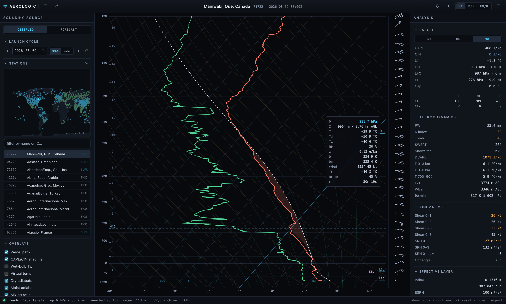
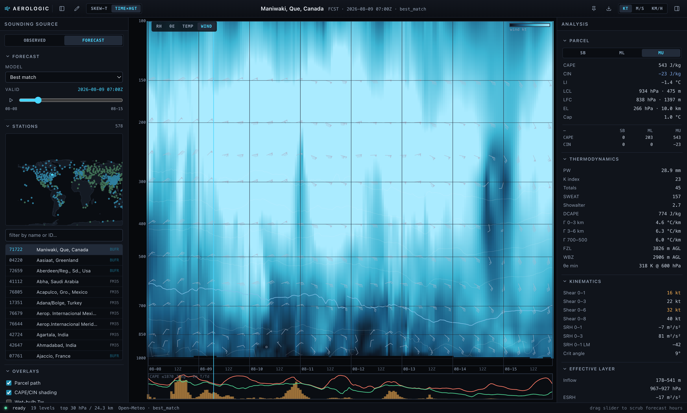

# AEROLOGIC — Skew-T Sounding Viewer

An interactive Skew-T log-P diagram for real radiosonde soundings and forecast
profiles.



*Time × height section of a model run — wind speed field with barbs, isotherm
overlays, and the model-CAPE / 2 m T/Td strip chart:*



## Data sources

- **Observed** — University of Wyoming upper-air archive (`weather.uwyo.edu/wsgi`).
  Twice-daily balloon launches from ~550 stations worldwide. BUFR-sourced
  stations provide **1-second native resolution** (4000–7000 levels per flight,
  including per-second balloon GPS positions, frost point, and RH over ice).
  FM35/TEMP stations provide classic significant-level data. The bundled Node
  proxy adds the CORS headers the archive lacks and caches immutable past
  soundings.
- **Forecast** — Open-Meteo pressure-level API (19 levels, surface data, and
  model CAPE/CIN for cross-checking) with a 7-day hourly scrubber across
  GFS, HRRR, ECMWF, ICON, GEM, ARPEGE, and UKMO.

## What it computes

All from scratch in `src/met/` (validated against Wyoming's own indices):

- Bolton (1980) moist thermodynamics: vapor pressure, mixing ratio, θ, θe,
  LCL temperature/pressure; RK4 pseudoadiabatic ascent/descent
- Parcel analysis for surface-based, 100-hPa mixed-layer, and most-unstable
  parcels: CAPE/CIN with virtual-temperature correction, LFC/EL, lifted index,
  cap strength
- DCAPE, precipitable water, freezing level, wet-bulb zero, lapse rates,
  K index, Total Totals, SWEAT, Showalter, θe minimum
- Kinematics: bulk shear (0–1/3/6/8 km), Bunkers storm motion, SRH (right and
  left movers), critical angle
- **Effective inflow layer** (Thompson et al. 2007) with ESRH, effective bulk
  wind difference, and effective SCP/STP alongside the fixed-layer variants
- CCL and convective (trigger) temperature; soaring thermal tops
- Fire weather: Haines index (elevation variant), mixing height, transport wind
- Winter: dendritic growth zone depth and mean RH
- Cloud and airframe-icing layer detection (drawn as bands on the diagram)
- SHIP composite

## The diagram

Hand-rolled canvas rendering (no chart library): skewed isotherms, log-p
isobars, dry/moist adiabats, mixing-ratio lines, CAPE/CIN area shading,
parcel path, wet-bulb and virtual-temperature overlays, standard wind barbs,
km height ticks, LCL/LFC/EL markers. Wheel-zoom in ln-p space, hover readout
with the full per-level state (θ, θe, Tw, frost point, RH over ice, seconds
since launch). Companion panels: auto-fitted hodograph colored by height band
with storm-motion markers, θe and storm-relative-wind profiles, and a
balloon-drift map drawn from the per-second GPS track.

**Time × height view** (forecast mode) — a BUFKIT-style section of the whole
model run: selectable heatmap field (RH / θe / T / wind speed) on a time ×
log-p grid, isotherm overlays with a highlighted freezing line, wind barbs,
day gridlines, and a surface strip chart of model CAPE bars with 2 m T/Td
traces. Hover for a full readout at any hour/level; click a column to jump the
forecast hour (the Skew-T view and analysis panel follow).

Also: **sounding modification** (pencil-toggle, then drag the T/Td curves —
Gaussian nudge, full re-analysis on release), **pin-as-reference comparison**
(overlay any sounding on any other: obs vs. model, run vs. run), **PNG export**,
**URL permalinks** (`#m=obs&st=71722&c=2026-08-09T00`), forecast hour
animation, click-anywhere forecast points, and favorite/recent stations.

## Run

```bash
npm install
node server/index.mjs   # proxy + static server on :8642
npm run dev             # Vite dev server on :5799 (proxies /api → :8642)
```

Production: `npm run build && npm start` — serves the built SPA and the proxy
from the single Node process on `:8642` (set `PORT` to override).

## Deploy (Fly.io)

The live instance runs at <https://aerologic.fly.dev>. The repo ships the
whole deployment: a multi-stage [`Dockerfile`](Dockerfile) (Vite build →
slim Node runtime with `server/` + `dist/`) and [`fly.toml`](fly.toml)
(port 8642, HTTPS forced, health check on `/api/health`, machines auto-stop
when idle so an unused instance costs ~nothing).

To deploy your own copy:

```bash
fly auth login
```

```bash
fly apps create <your-app-name>
```

Then point `fly.toml` at your app — edit the first line (`app = "<your-app-name>"`)
and pick your `primary_region` — and ship it:

```bash
fly deploy --remote-only
```

`--remote-only` builds the image on Fly's builders, so you don't need Docker
locally. Subsequent releases are just `fly deploy` again. No secrets or env
vars are required — both upstream data sources (University of Wyoming,
Open-Meteo) are public APIs, and the app is fully stateless (the proxy cache
is in-memory, so it simply warms back up after a machine restart).

## Layout

```
server/index.mjs   dependency-free proxy + static server
src/met/           thermodynamics, parcel physics, indices, kinematics
src/data/          Wyoming CSV/JSON parsers, Open-Meteo client
src/skewt/         coordinate transform + canvas renderer + interaction
src/timeheight/    BUFKIT-style time × log-p section of a forecast run
src/ui/            panels: stations, indices, hodograph, drift, chrome
scripts/validate.ts  physics check against Wyoming's published indices
```
